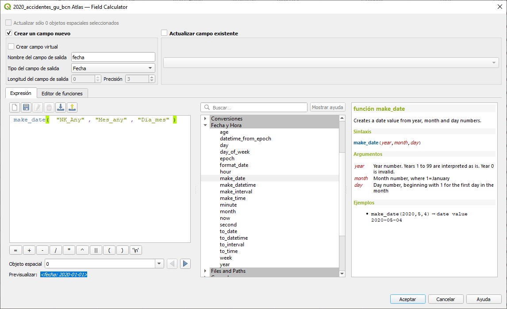

# 1- CALCULADORA DE CAMPOS
Primero abrimos la tabla de atributos para identificar que campos y que valores disponemos.
Detectar que campos podemos utilizar para crear un campo de tipo **fecha** (date)

### Crear un campo nuevo con el nombre [fecha] de tipo "fecha", y utilizamos la siguiente expresión para asignarle el valor de fecha correspondiente
<code>make_date(  "NK_Any" , "Mes_any" , "Dia_mes" )</code>

## Calculadora de campos

### Crear otro campo nuevo con el nombre [fecha_fin] de tipo "fecha", y calcularemos la fecha 15 después de la fecha del accidentes
<code>"fecha" +  to_interval( '15 day')</code>

### Crear otro campo nuevo con el nombre [dia_anyo] de tipo "entero", y calcularemos el día del año, a partir del 1 de enero del 2020
<code>day(age("fecha" ,  to_date( '2020-01-01')))</code>
