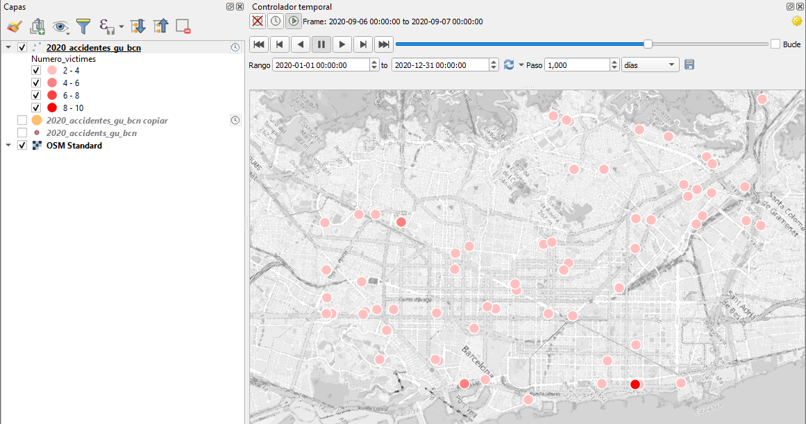

# 2- TIME MANAGER
Primero preparamos el proyecto, vamos a las propiedades del proyecto para definir la fecha inical y final

### Definimos las propiedades de la capa de accidentes:
## Opción 1: Una fecha

## Opción 2: fecha de inicio y fecha de fin

## Observamos el panel "Time Manager"

