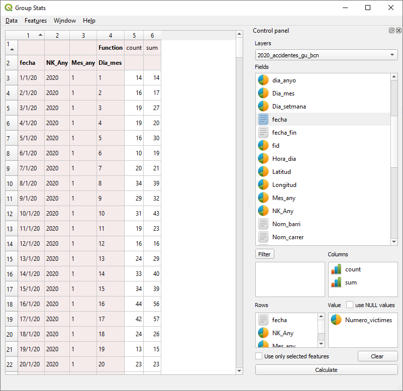
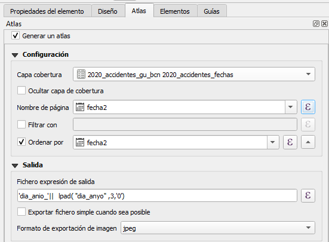

# 3- ATLAS
Vamos a crear una composición y configuraremos el Atlas para crear una serie de mapas(imágenes) que luego utilizaríamos para crear un video de tipo "TimeLaps".

### Primero vamos a crear una tabla con las fechas únicas del año con el complemento "Group Stats"

1. Exportamos a CSV en la carpeta donde tenemos los datos de los accidentes
2. Editamos el CSV con un editor de texto y ordenamos las 2 primeras filas, para que quede solo una y bien ordenada
3. Cargamos el CSV en QGIS como "Texto delimitado" (sin geometrías)
4. Exportamos a GeoPackage para poder editar la tabla, puede ser el mismo GeoPackage donde hemos guardado los accidentes
5. Creamos un campo nuevo, nombre **fecha** de tipo **fecha(date)** con la fecha de los accidentes

<code>**make_date**(  "NK_Any" , "Mes_any" , "Dia_mes" )</code>

6. Creamos un nuevo campos con el día del año

<code>day(age("fecha" ,  to_date( '2020-01-01')))</code>

### Configuramos el Atlas
Creamos una nueva composición de tamaño Personalizada 1920 * 1080 (FullHD)

Propiedades de la página
Tamaño de página
- Anchura = 1920 px (192 mm)
- Altura = 1080 px (108 mm)

Diseño:
- 254 ppp (dpi)
- 

